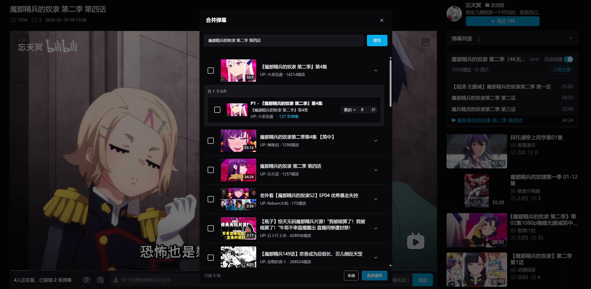
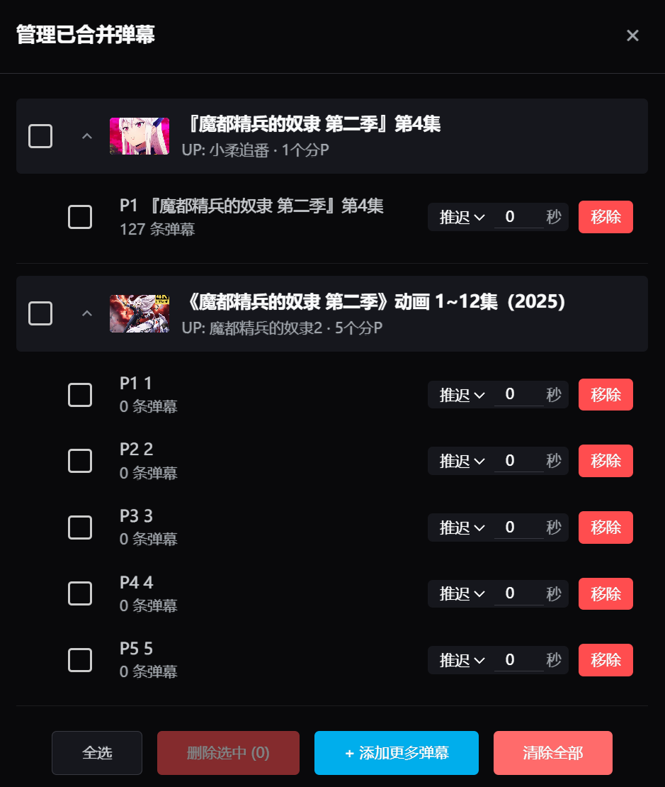
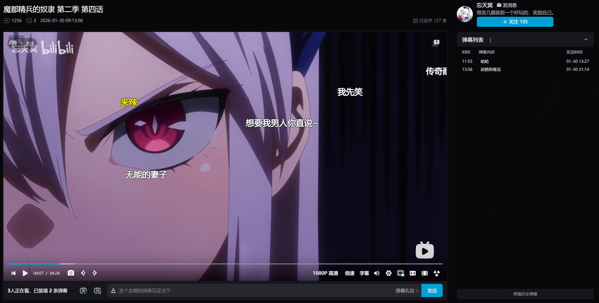

自用油猴脚本库

# B站弹幕合并器
旨在提升 B 站视频观看体验。它允许你将其他 B 站视频的弹幕实时合并到当前播放的视频中，特别适合观看录播、多机位视频或需要同步其他投稿弹幕的场景。
## 功能特点

- **多源合并**：支持通过关键词搜索或直接输入 BV 号获取其他视频的弹幕。
- **精确匹配**：支持选择目标视频的具体分 P（Part）。
- **同步校准**：提供时间偏移（Offset）调整功能，确保弹幕与当前进度完美同步。
- **深度适配**：针对“时间弹幕”做了跳转适配，点击弹幕中的时间戳可正常跳转。
- **原生集成**：在 B 站视频播放页无缝添加“合并弹幕”按钮，操作简便。

## 预览

### 搜索界面
通过关键词或 BV 号快速查找目标视频。

### 管理界面
选择分 P 并设置时间偏移。

### 弹幕效果
多源弹幕同屏显示，增强互动感。

### 支持时间跳转
适配时间戳弹幕，支持点击跳转。

## 更新日志

- **2026-02-01 (v1.4)**
  - **适配“稍后再看”页面**：支持在稍后再看合并弹幕及管理。
  - **弹幕预览功能**：支持在管理面板直接点击弹幕条目查看内容预览。
  - **快速并入增强**：视频卡片右下角新增“一键并入”按钮，支持封面图快速合并弹幕。
  - **UI/UX 优化**：重构了快速合并按钮样式，适配 B 站原生风格，优化了提示气泡。
- **2026-01-31 (v1.0)**：正式发布，支持多源合并、时间偏移校准。

## 安装说明

1. 确保浏览器已安装 [Tampermonkey](https://www.tampermonkey.net/) 插件。
2. 前往 [Greasy Fork](https://greasyfork.org/zh-CN/scripts/564661-b%E7%AB%99%E5%BC%B9%E5%B9%95%E5%90%88%E5%B9%B6%E5%99%A8) 点击安装（推荐）。
3. 或者下载并手动安装本仓库中的 `Bilibili_Danmaku_Merger.js` 脚本。
4. 刷新 B 站视频页面即可在播放器下方或侧边看到“合并弹幕”按钮。

## 许可证

本项目采用 [MIT License](./LICENSE) 开源。
