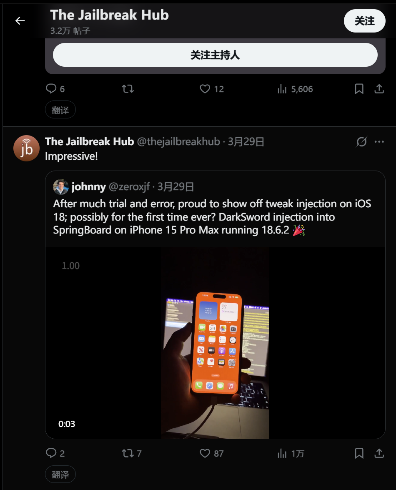
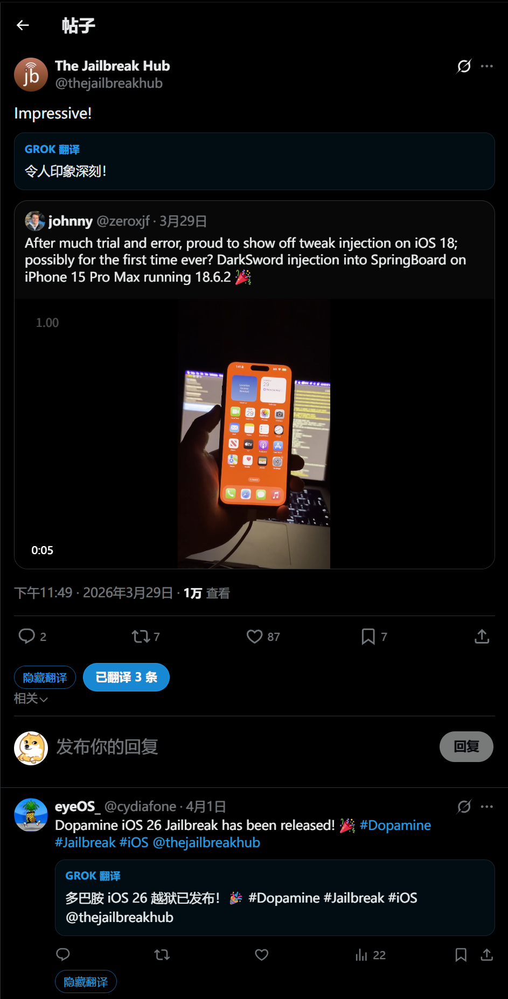
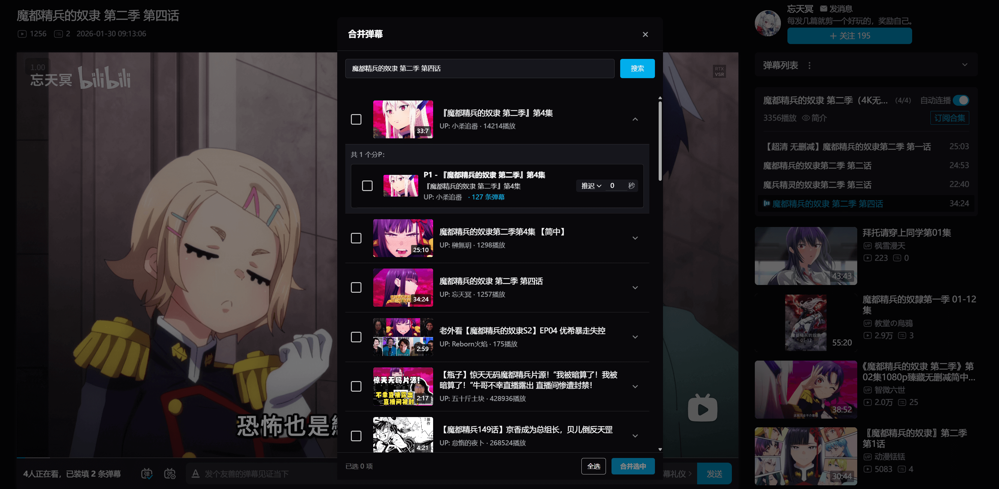
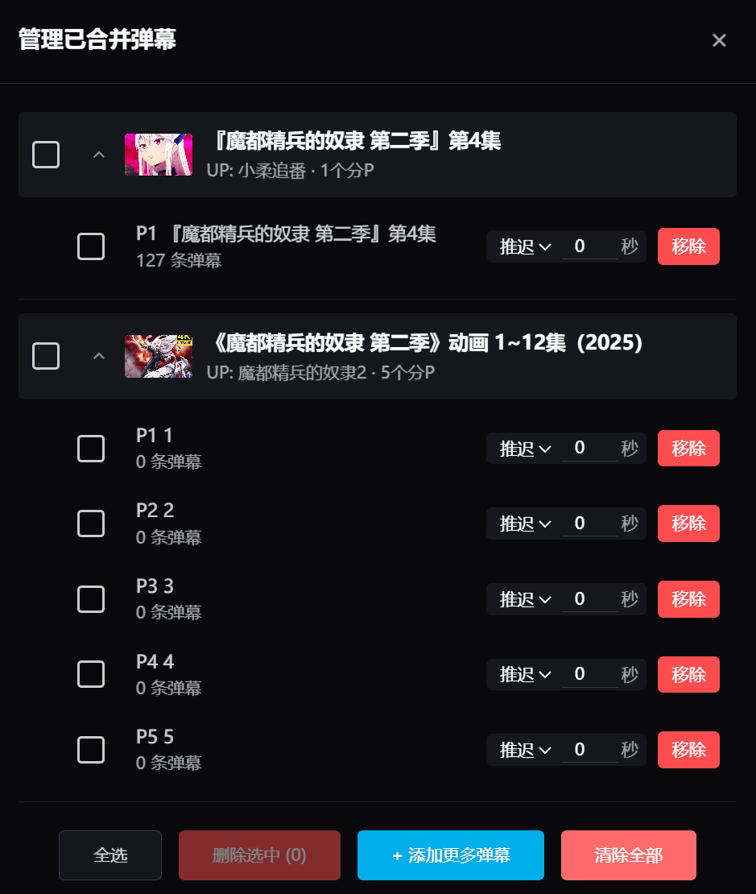
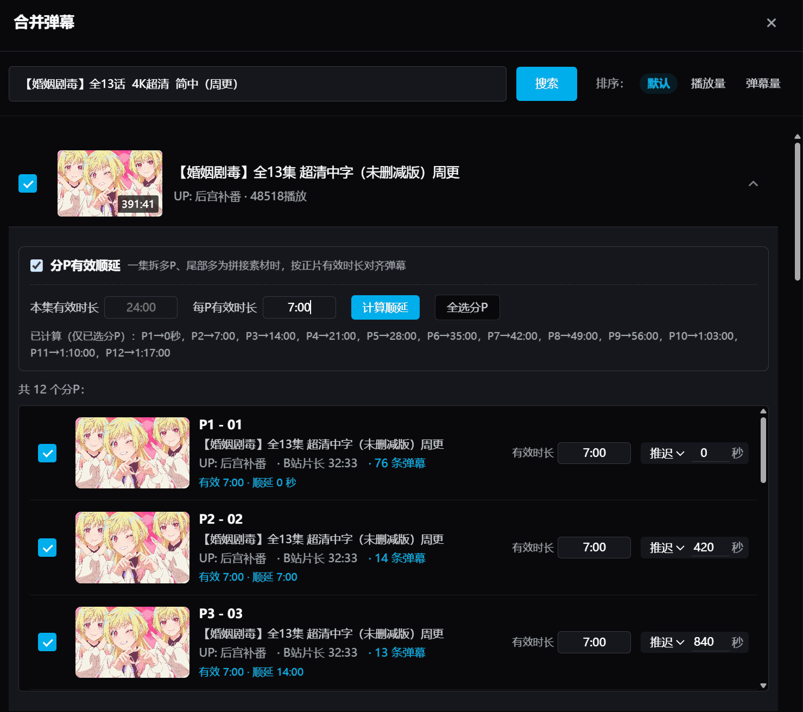
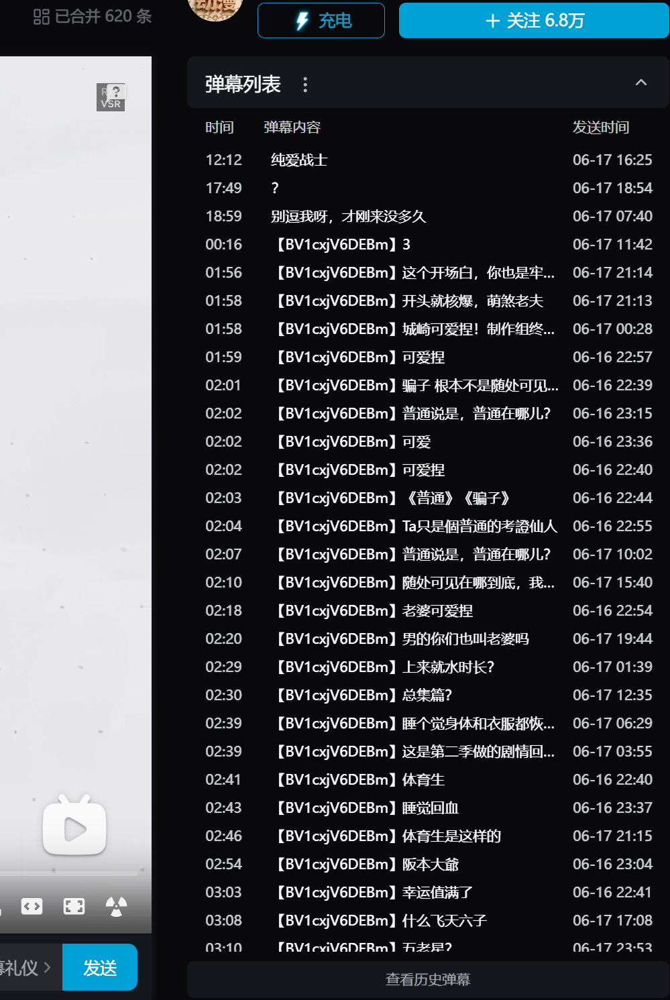
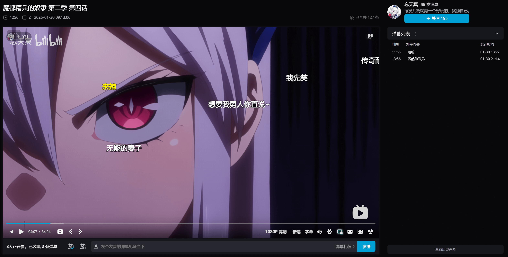
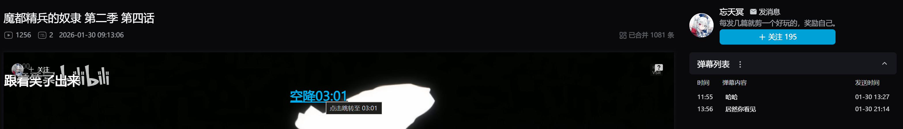

自用油猴脚本库

## X Grok 翻译按钮外置
在 X（原 Twitter）的信息流和帖子详情页外置官方 Grok 翻译入口，减少点击层级，方便快速查看帖子与回复的中文翻译。

### 功能特点

- **信息流直达**：在首页信息流的帖子操作区直接插入翻译按钮。
- **贴内翻译**：在帖子详情页里，可对主帖和回复分别触发翻译。
- **批量翻译**：主帖区域提供“翻译全部”，可连续处理当前可见内容。
- **结果内嵌展示**：翻译结果直接显示在原帖下方，不打断浏览流程。
- **沿用官方能力**：复用 X 官方 Grok 翻译接口，尽量保持原生体验。

### 预览

#### 信息流翻译效果

#### 贴内翻译效果

### 安装说明

1. 确保浏览器已安装 [Tampermonkey](https://www.tampermonkey.net/) 插件。
2. 下载并安装仓库中的 `X_Grok_Translate_External.js`。
3. 打开 [X](https://x.com/) 并登录账号，刷新页面后即可在帖子操作区看到“翻译”按钮。

### 使用说明

1. 在首页信息流中，点击任意帖子下方的“翻译”按钮即可查看中文翻译。
2. 在帖子详情页中，可对主帖和回复分别点击“翻译”。
3. 如需快速浏览整串讨论，可点击主帖区域的“翻译全部”。

## B站弹幕合并器

将其他 B 站视频的弹幕合并进**原生播放器画面**与**右侧弹幕列表**（不自绘），适合录播、多机位、跨投稿补弹幕等场景。

### 功能特点

- **多源合并**：关键词搜索或 BV 号获取弹幕，支持按分 P 勾选合并。
- **原生注入**：写入 DanmakuX 画面层与弹幕列表，列表带 `【BV号】` 前缀，画面保持原文。
- **分P有效顺延**：UP 将一集拆多 P、尾部拼接无关素材时，按正片有效时长自动计算各 P 弹幕顺延（B 站片长仅作对照）。
- **同步校准**：支持手动推迟/提前；注入过程保持当前播放进度，不从头播放。
- **管理面板**：已合并源按 BV 分组展示，可调整偏移、预览弹幕、批量移除。
- **深度适配**：时间戳弹幕可点击跳转；支持稍后再看页与推荐区快速并入。

### 预览

#### 搜索界面
通过关键词或 BV 号快速查找目标视频。

#### 管理界面
选择分 P 并设置时间偏移。

#### 分P有效顺延
多 P 一集场景下，按有效内容时长自动计算顺延，无需手算推迟秒数。

#### 注入原生播放器
弹幕写入 B 站原生画面与右侧列表，与站内弹幕同屏显示。

#### 弹幕效果
多源弹幕同屏显示。

#### 支持时间跳转
适配时间戳弹幕，支持点击跳转。

### 更新日志

- **2026-06 (v1.6)**
  - **原生注入**：合并弹幕写入播放器画面与右侧列表，列表 BV 前缀、画面无前缀。
  - **分P有效顺延**：按正片有效时长自动计算多 P 顺延；展开分 P 默认不自动开启、不全选。
  - **播放进度保持**：注入与 Store 捕获后恢复当前播放位置。
- **2026-02-01 (v1.4)**
  - 适配稍后再看页；管理面板弹幕预览；推荐区一键并入。
- **2026-01-31 (v1.0)**：首发，多源合并与时间偏移。

### 安装说明

1. 确保浏览器已安装 [Tampermonkey](https://www.tampermonkey.net/) 插件。
2. 前往 [Greasy Fork](https://greasyfork.org/zh-CN/scripts/564661-b%E7%AB%99%E5%BC%B9%E5%B9%95%E5%90%88%E5%B9%B6%E5%99%A8) 点击安装（推荐）。
3. 或手动安装本仓库中的 `Bilibili_Danmaku_Merger.js`。
4. **Ctrl+F5** 硬刷新 B 站视频页，播放 5～10 秒后再合并（确保弹幕引擎就绪）。

## 许可证

本项目采用 [MIT License](./LICENSE) 开源。